# HexTTS Architecture Graphs (Mermaid)

This file contains Mermaid diagrams for the HexTTS project.
Paste these directly into GitHub README, documentation, or Mermaid Live Editor.

---

## 1. HexTTS System Overview

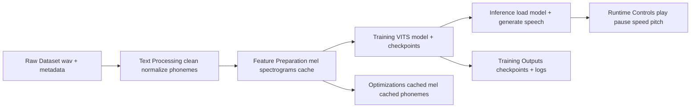
---

## 2. Dataset Preparation Flow

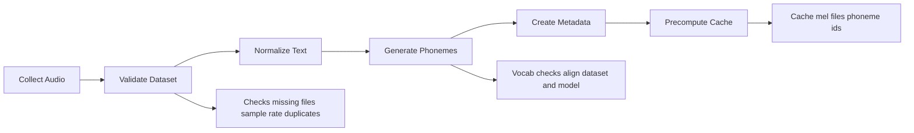
---

## 3. Training Pipeline

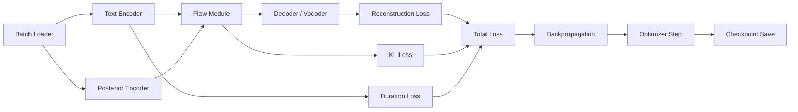
---

## 4. Inference Pipeline

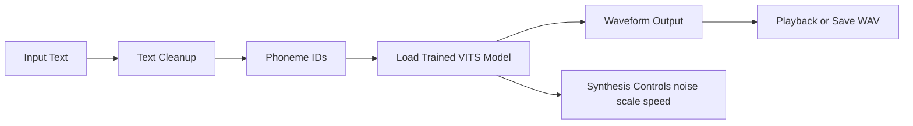
---

## 5. Training Metrics Dashboard

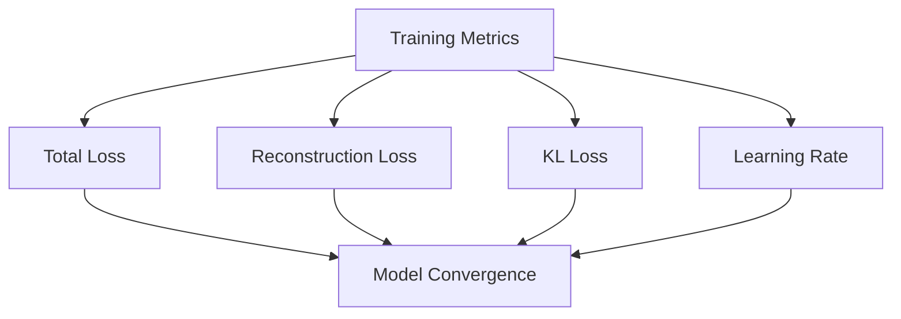
---

## 6. Deployment Flow

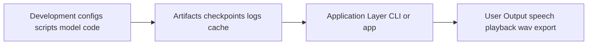
---

## 7. VITS Architecture

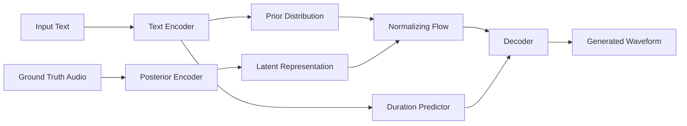
---

## 8. TTS Architecture Comparison

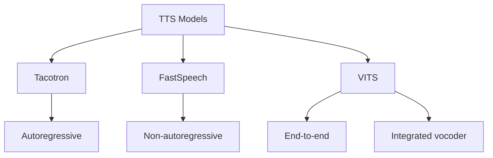
---

## 9. Mel Spectrogram Pipeline

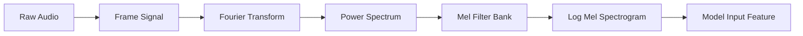
---

## 10. Checkpoint Resume Logic

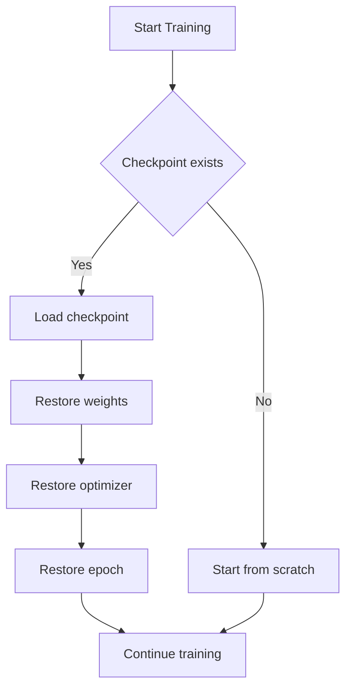
---

## 11. Cached Training Flow

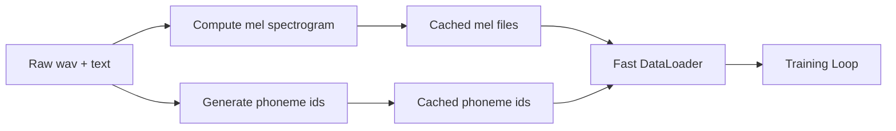
---

## 12. Vocabulary Consistency Fix

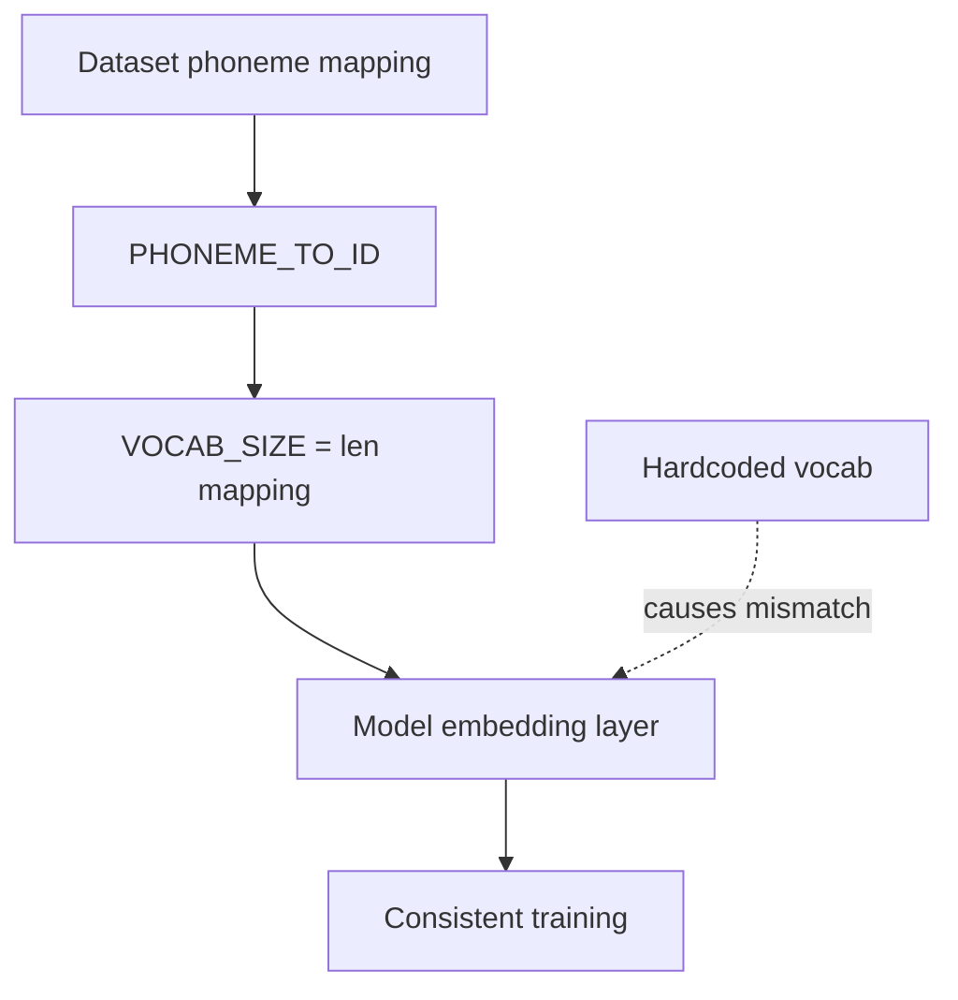
