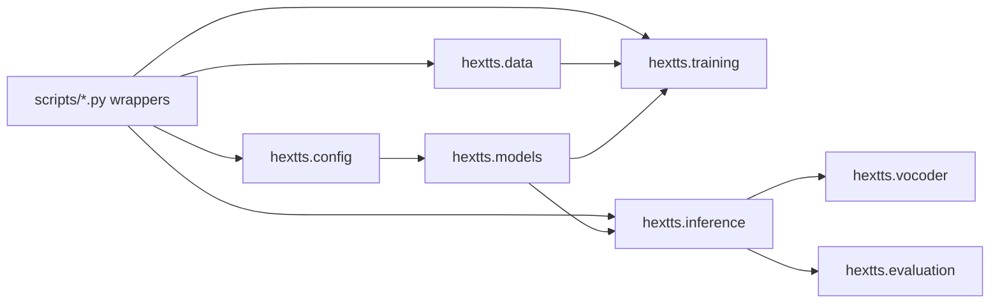

# HexTTs Architecture

HexTTs separates reusable package logic from command-line wrappers. The project is designed so training, inference, evaluation, and preprocessing share the same runtime contracts instead of duplicating behavior across scripts.

For the complete project narrative, start with [Documentation Index](index.md), [Project Rationale](project-rationale.md), and [System Flow](system-flow.md).

## Architecture Direction

- Shared runtime logic lives under `hextts/`.
- User-facing commands live under `scripts/` as thin wrappers.
- Config loading, dataloader selection, checkpoint validation, and inference construction are centralized.
- Historical notes and archived documents remain available, but maintained documentation lives in `docs/`.



## Package Layout

```text
hextts/
  config/
    load.py             shared config loader
    schema.py           runtime invariants and validation
  data/
    dataloaders.py      raw/cached dataloader selection
    preprocessing.py    LJSpeech preparation and phoneme metadata
    cache_builder.py    precomputed mel/id feature cache
    raw_dataset.py      raw audio dataset path
    cached_dataset.py   cached feature dataset path
  models/
    vits.py             shared model builder
    vits_impl.py        VITS-style model modules
    checkpointing.py    save/load and compatibility checks
  training/
    trainer.py          training runner
    losses.py           loss helpers
    callbacks.py        callback protocol
    logging.py          logger setup
  inference/
    pipeline.py         shared inference engine
    text_processing.py  phoneme/id helpers
    synthesize.py       synthesis helper
  vocoder/
    hifigan.py          HiFi-GAN wrapper
    griffin_lim.py      Griffin-Lim fallback
    factory.py          vocoder construction
  evaluation/
    metrics.py          objective audio metrics
    audio_eval.py       single/batch evaluation
    reports.py          report printing
  utils/
    audio.py            waveform helpers
    io.py               path/text helpers
    versioning.py       checkpoint metadata helpers
    warnings.py         warning configuration
```

## Runtime Entrypoints

Primary workflows:

```bash
python scripts/prepare_data.py ./data/LJSpeech-1.1 ./data/ljspeech_prepared
python scripts/precompute_features.py --config configs/base.yaml
python scripts/train.py --config configs/base.yaml --device cuda
python scripts/infer.py --checkpoint checkpoints/best_model.pt --config configs/base.yaml --text "hello world" --output tts_output/hello.wav
python scripts/evaluate_tts_output.py --audio tts_output/hello.wav --sample_rate 22050
```

Simplified workflow wrapper:

```bash
python scripts/main_flow.py train --device cuda
python scripts/main_flow.py infer --text "hello world" --output tts_output/output.wav --hifigan
python scripts/main_flow.py compare --text "we are at present concerned"
```

## Contract Boundaries

- Configs define paths, mel settings, model dimensions, training controls, and inference defaults.
- Dataloaders expose the same high-level training interface for raw and cached data.
- Checkpoints include metadata so incompatible config/model combinations fail early.
- Inference uses the same model builder and vocabulary assumptions as training.
- Evaluation is separate from inference so generated audio can be compared across runs.

## Related Deep Dives

- [Data Pipeline](data-pipeline.md)
- [Model and Training](model-training.md)
- [Inference and Evaluation](inference-evaluation.md)
- [Operations and Troubleshooting](operations-troubleshooting.md)
