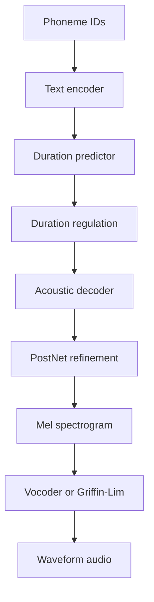

# Model And Training

HexTTs trains a compact VITS-style text-to-speech model. The current system is optimized for practical local experimentation rather than claiming full production-grade VITS parity.

## Model Role

The model receives phoneme ID sequences and predicts mel spectrograms. A vocoder or reconstruction method later turns those mel spectrograms into waveform audio.

At a high level:



```text
phoneme IDs
  -> text encoder
  -> duration predictor
  -> duration regulation
  -> acoustic decoder
  -> postnet refinement
  -> mel spectrogram
```

## Architecture Components

The implementation is organized under `hextts/models/`:

- `vits.py` provides the shared model build path.
- `vits_impl.py` contains the model modules.
- `modules.py` contains reusable model helpers.
- `checkpointing.py` handles checkpoint metadata, compatibility checks, saving, and loading.

The major model concepts are:

- text encoder: transforms phoneme IDs into hidden speech representations
- duration predictor: estimates how long phoneme-level representations should last
- decoder: predicts mel spectrogram frames
- postnet: refines predicted mel output
- compatibility metadata: prevents accidental checkpoint/config mismatches

## Training Entrypoint

Use:

```bash
python scripts/train.py --config configs/base.yaml --device cuda
```

Debug and smaller profiles are available:

```bash
python scripts/train.py --config configs/debug.yaml --device cuda
python scripts/train.py --config configs/sanity.yaml --device cuda
python scripts/train.py --config configs/continue3.yaml --device cuda
```

Resume from a checkpoint:

```bash
python scripts/train.py --config configs/base.yaml --checkpoint checkpoints/checkpoint_step_080000.pt --device cuda
```

## Config-Driven Training

`configs/base.yaml` is the canonical full training config. It controls:

- dataset paths
- mel/STFT settings
- model dimensions
- optimizer and scheduler settings
- batch size and epoch count
- loss weights
- validation and checkpoint intervals
- AMP and stability guardrails
- inference defaults
- cached feature selection

The config validator checks required keys and core audio invariants such as:

- positive sample rate and mel channel count
- positive batch size and learning rate
- `mel_hop_length <= mel_win_length <= mel_n_fft`
- `mel_f_max <= sample_rate / 2`

## Losses

Training combines several signals:

- reconstruction loss for predicted mel quality
- KL loss for latent regularization behavior
- duration loss for timing supervision
- pre/postnet mel supervision
- multi-scale spectral mel loss

Duration has both token-level and utterance-level supervision controls:

```yaml
duration_token_alpha: 1.0
duration_sum_beta: 0.2
```

This reflects a core TTS tradeoff: the model needs phoneme-level timing, but total utterance duration also needs to remain realistic.

## Stability Guardrails

Training instability is expected in custom TTS work, especially around duration behavior. HexTTs includes guardrails such as:

```yaml
grad_clip_val: 0.6
max_seq_length: 300
max_duration_value: 20.0
max_skipped_ratio: 0.5
duration_debug_checks: false
```

These settings help prevent one unstable batch pattern from silently corrupting a run. If too many batches are skipped, the run should stop instead of producing a misleading checkpoint.

## Checkpoint Strategy

Checkpoints are more than raw model weights. They also carry metadata that is validated on load. This matters because training and inference must agree on architecture-sensitive settings such as mel dimensions, vocabulary size, and model shape.

Recommended practice:

- keep `checkpoints/best_model.pt` for inference comparison
- keep recent step checkpoints for resume options
- avoid resuming from a checkpoint produced after obvious NaN instability
- compare generated samples after major training changes

## Why Output Quality Can Lag Behind Training Progress

Loss curves can improve before speech sounds natural. Common reasons include:

- the model predicts mel structure but not realistic fine timing
- duration supervision is incomplete or noisy
- Griffin-Lim reconstruction adds artifacts
- HiFi-GAN quality depends on compatible mel distributions
- the simplified architecture omits components found in full VITS systems

That is why the project pairs training logs with audio generation and waveform evaluation.

## Next Model Improvements

The most important future improvements are:

- stronger alignment learning
- better duration supervision and sample filtering
- deeper vocoder validation
- more complete VITS components
- richer experiment tracking across checkpoints
