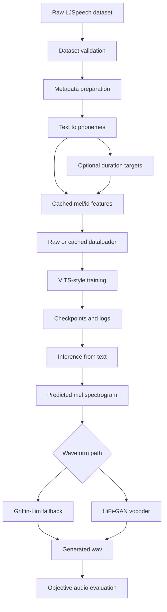

# System Flow

HexTTs is organized as a pipeline. Each stage produces artifacts that the next stage consumes, which makes failures easier to isolate.

## End-To-End Flow



```text
Raw LJSpeech dataset
  -> dataset validation
  -> metadata preparation
  -> phoneme conversion
  -> optional duration alignment
  -> cached mel/id feature generation
  -> dataloader
  -> VITS-style training
  -> checkpoints and logs
  -> inference from text
  -> mel spectrogram prediction
  -> Griffin-Lim or HiFi-GAN waveform synthesis
  -> objective audio evaluation
```

## Stage 1: Raw Dataset

The raw input is the LJSpeech directory:

```text
data/LJSpeech-1.1/
  metadata.csv
  wavs/
```

The dataset validation script checks whether the expected files exist and whether prepared/cache artifacts are consistent when present:

```bash
python scripts/validate_dataset.py ./data/LJSpeech-1.1
```

## Stage 2: Prepared Metadata

The preparation step reads LJSpeech metadata, converts normalized text into ARPAbet-style phonemes with `g2p_en`, splits samples into train/validation sets, and writes metadata files:

```bash
python scripts/prepare_data.py ./data/LJSpeech-1.1 ./data/ljspeech_prepared
```

Prepared output:

```text
data/ljspeech_prepared/
  train.txt
  val.txt
  metadata.json
```

Each training line follows:

```text
filename|PHONEME PHONEME PHONEME
```

This keeps the runtime model input explicit and reproducible.

## Stage 3: Duration Targets

Duration targets can be produced into:

```text
data/ljspeech_prepared/durations
```

They are used to supervise timing behavior. When duration targets are missing or disabled, the project can fall back to pseudo-uniform duration behavior, but real duration information is more useful for stable timing.

## Stage 4: Cached Features

Cached features reduce repeated audio preprocessing during training. The cache step converts metadata and source audio into reusable mel/id artifacts:

```bash
python scripts/precompute_features.py --config configs/base.yaml
```

The config switch controls which dataloader path is used:

```yaml
use_cached_features: true
```

Cached loading is the recommended path for normal training because it reduces repeated mel extraction cost and makes iteration faster.

## Stage 5: Training

Training is config-driven:

```bash
python scripts/train.py --config configs/base.yaml --device cuda
```

The training runner builds dataloaders, constructs the model, computes losses, writes logs, and saves checkpoints under the configured directories:

```yaml
log_dir: ./logs
checkpoint_dir: ./checkpoints
```

Checkpoint resume is explicit:

```bash
python scripts/train.py --config configs/base.yaml --checkpoint checkpoints/checkpoint_step_080000.pt --device cuda
```

## Stage 6: Inference

Inference starts from raw text, converts it to phonemes, maps phonemes to IDs, predicts a mel spectrogram, and converts that mel output to waveform audio.

```bash
python scripts/infer.py --checkpoint checkpoints/best_model.pt --config configs/base.yaml --text "hello world" --output tts_output/hello.wav
```

The fallback waveform path is Griffin-Lim. The preferred higher-quality path is HiFi-GAN when the vocoder assets are available:

```bash
python scripts/infer.py --checkpoint checkpoints/best_model.pt --config configs/base.yaml --vocoder_checkpoint hifigan/generator_v1 --vocoder_config hifigan/config_v1.json --text "we are at present concerned" --output tts_output/output_hifigan.wav
```

## Stage 7: Evaluation

Generated audio is evaluated with objective waveform metrics:

```bash
python scripts/evaluate_tts_output.py --audio tts_output/output_hifigan.wav --sample_rate 22050
```

The metrics are not a replacement for listening tests, but they are useful for detecting obvious issues such as excessive silence, clipping, unstable amplitude, and noisy high-frequency behavior.

## Simplified Control Surface

For repeated workflows, `scripts/main_flow.py` wraps common commands:

```bash
python scripts/main_flow.py audit --dry-run
python scripts/main_flow.py train --device cuda
python scripts/main_flow.py infer --text "hello world" --output tts_output/output.wav --hifigan
python scripts/main_flow.py compare --text "we are at present concerned"
python scripts/main_flow.py continuation-test --epochs 3
```

This wrapper is useful for portfolio review because it shows that the project is operated through stable workflows, not only ad hoc scripts.
